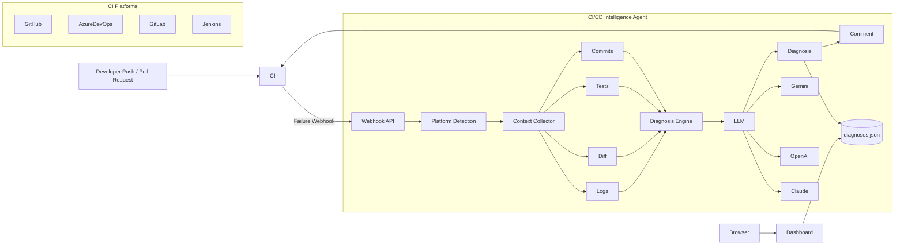
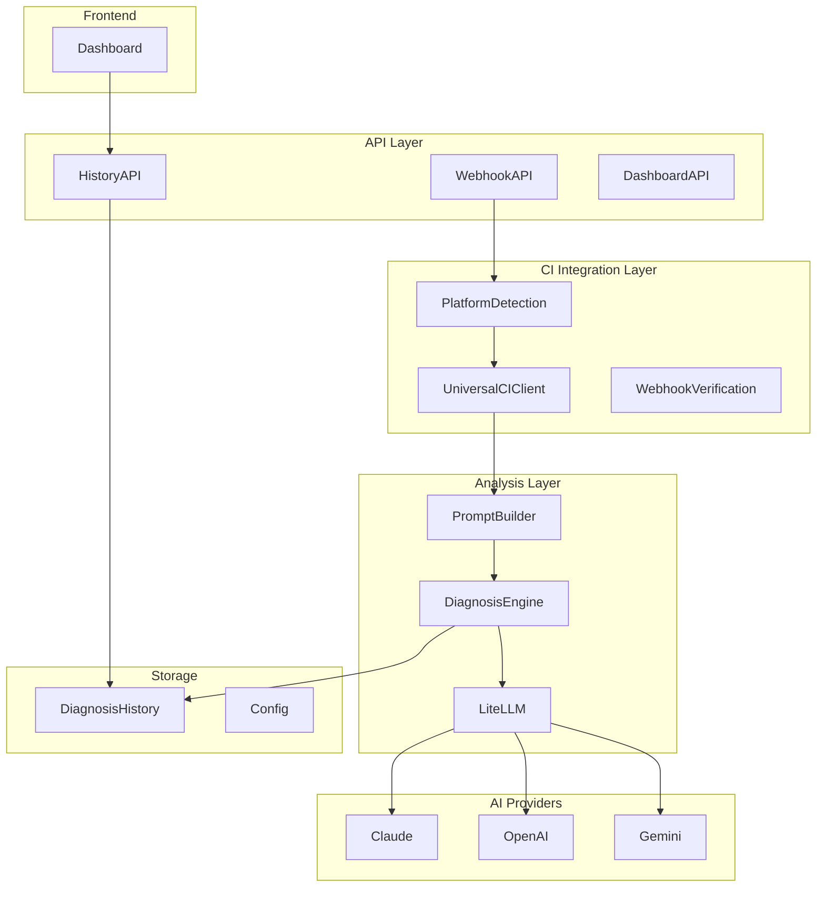
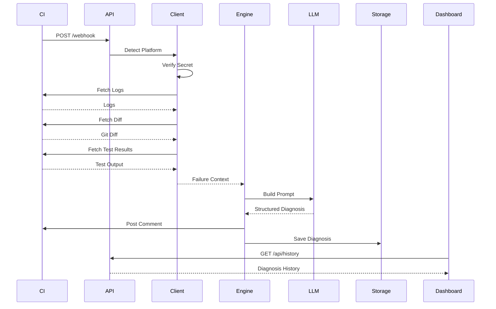
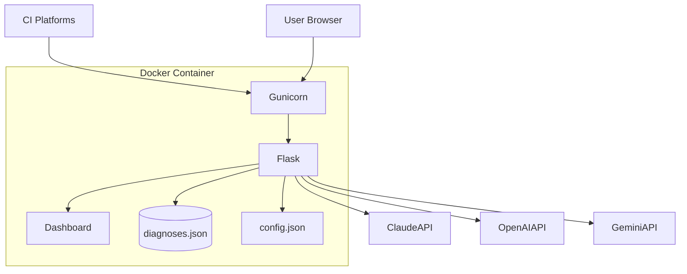
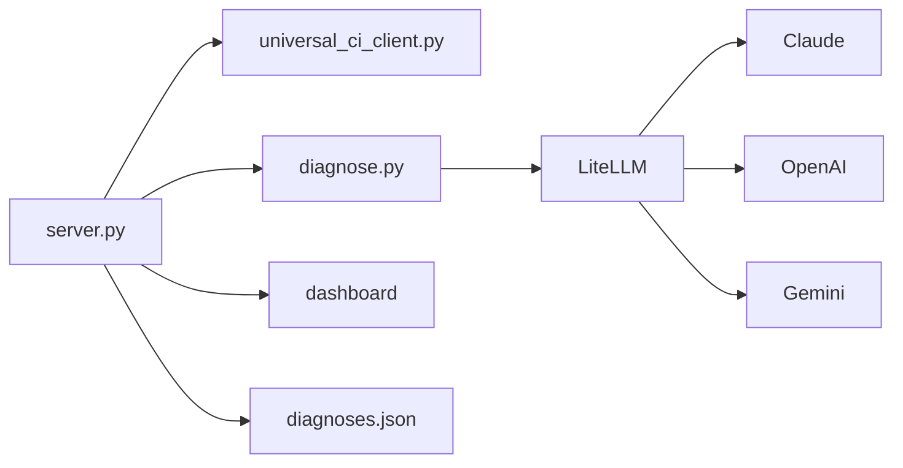
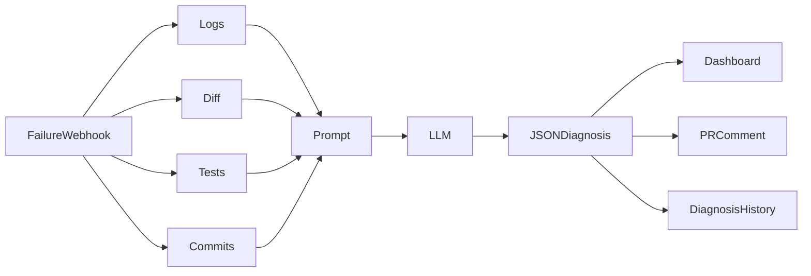

# CI/CD Intelligence Agent Architecture

## Overview

The **CI/CD Intelligence Agent** is an AI-powered diagnostic service that automatically analyzes failed CI/CD pipeline executions. It integrates with multiple CI platforms, collects execution context, uses an LLM to determine the root cause, posts actionable feedback back to the pipeline or pull request, and stores historical diagnostics for visualization through a web dashboard.

### Supported CI Platforms

- GitHub Actions
- Azure DevOps
- GitLab CI
- Jenkins

### Supported AI Providers

- Claude
- OpenAI
- Gemini

---

# 1. Overall System Architecture



## Architecture Description

The workflow begins when a developer pushes code or creates a pull request.

If the CI pipeline fails:

- The CI platform sends a webhook.
- Flask receives the event.
- The platform is detected automatically.
- Logs, Git diff, commits, and test failures are collected.
- The Diagnosis Engine builds a prompt.
- An LLM generates a structured diagnosis.
- The diagnosis is posted back to the PR/build.
- Results are stored locally.
- The dashboard displays previous failures.

---

# 2. Component Architecture



## Component Description

| Layer | Responsibility |
|---------|---------------|
| API Layer | Receives webhooks and serves dashboard APIs |
| CI Integration Layer | Detects CI platform, validates secrets, and collects build context |
| Analysis Layer | Creates AI prompt, invokes the LLM, and parses structured output |
| AI Providers | Claude, OpenAI, and Gemini inference |
| Storage Layer | Stores configuration and diagnosis history |
| Dashboard | Displays historical failures and diagnostics |

---

# 3. Processing Workflow



---

# 4. Deployment Architecture



## Deployment Description

The application runs inside a Docker container using Gunicorn as the production web server. Flask serves both the REST API and the dashboard. Configuration is loaded from `config.json` or environment variables, while diagnosis history is persisted in `diagnoses.json`.

---

# 5. Internal Module Architecture



## Module Responsibilities

| Module | Responsibility |
|---------|---------------|
| `server.py` | Entry point, webhook handling, routing, history API |
| `universal_ci_client.py` | Platform detection, webhook verification, build context collection |
| `diagnose.py` | Prompt generation, LLM invocation, response parsing |
| `dashboard/` | Static web interface for diagnosis history |
| `diagnoses.json` | Persistent storage of recent diagnostic records |
| `config.json` | Runtime configuration and provider settings |

---

# 6. Data Flow



## Data Contract

```json
{
  "root_cause": "One clear sentence explaining exactly why the build failed.",
  "technical_detail": "Detailed explanation including relevant file, line, or error context.",
  "affected_files": [
    {
      "file": "path/to/file.py",
      "line": 42,
      "reason": "Short description of the issue."
    }
  ],
  "suggested_fix": "Plain-English guidance describing the required changes.",
  "suggested_fix_code": "Optional code snippet or unified diff.",
  "confidence": "high",
  "category": "test_failure",
  "related_commit": "Commit SHA or message if identifiable."
}
```
